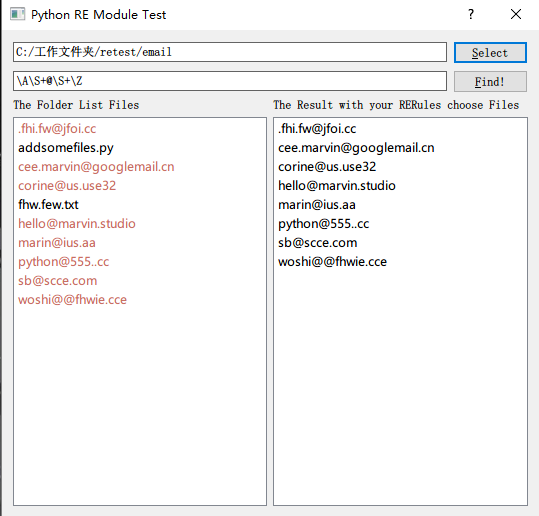
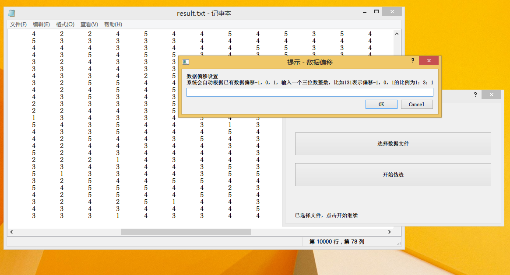

# Welcome，Github Guys！

> 这里是我在学习Python GUI编程(QT)、PyGame以及一些优秀的内置和第三方模块的学习测试代码和一些我自己写的程序。

 

1、PyQt 5 GUI 程序：一个测试和学习正则表达式的小工具

- 位置： [pyqt_gui/regexp_test.py](pyqt_gui/regexp_test.py)
- 说明：此程序打开后会加载当前目录下的文件，以列表显示。你可以对其进行正则判断，输出结果在右边列表显示。
- 亮点：原始列表自动标红、及时反馈结果，而不需要点击“应用”按钮、可以使用键盘操作，但对鼠标交互亦做了优化。
- 依赖：PyQt 5 ，Python 3

 

2、PyQt 5 GUI 程序：根据已有问卷数据生成新的问卷数据的实用工具

- 位置：[https://github.com/corkine/cmTools/tree/master/fakePsyData_201942](fakePsyData_201942/FAKEDATA.pyw)
- 说明：此程序根据 data.txt 文件生成新的数据文件。每生成一个新的文件的过程中，程序会随机选择已有的一条数据，对于其性别、年龄、问卷值进行自定义偏移。
- 亮点：生成的数据和之前的数据不重复，但是满足相似的正态分布，具有相似的方差和平均值。我们根据200份数据生成了10000份数据，在SPSS中进行分析，发现其平均值和方差均一样(小数点后两位)，选择的数据偏移比为1；8；1。
- 使用方法：选择 data.txt 文件，加载到程序，点击开始，选择需要的份数、性别比例、年龄区间以及已有值得偏移之比，如果为0：1：0，则数据偏移-1，0，1个单位（五点计分，如果原始数值为4，则偏移后分别为3，4，5）的比例为0：1：0，这就生成了和原始数据一样的值。

